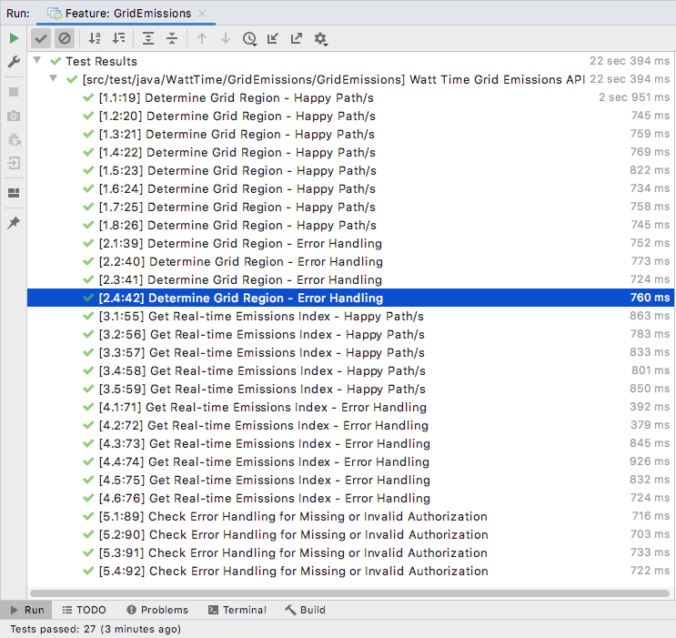
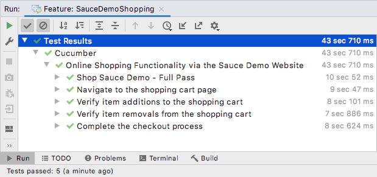

# QA Portfolio

## API Testing with [_Karate_](./api-testing/karate-dsl)

## API Testing with [_SuperTest_](./api-testing/supertest-node)

## UI Testing with [_Selenium Java_](./ui-testing/selenium-java)

## UI Testing with [_Cucumber Java_](./ui-testing/cucumber-java)

## UI Testing with [_Cypress_](./ui-testing/cypress-node)

### `Karate`

### `SuperTest`

### `Selenium Java`

### `Cucumber Java`

### `Cypress`

