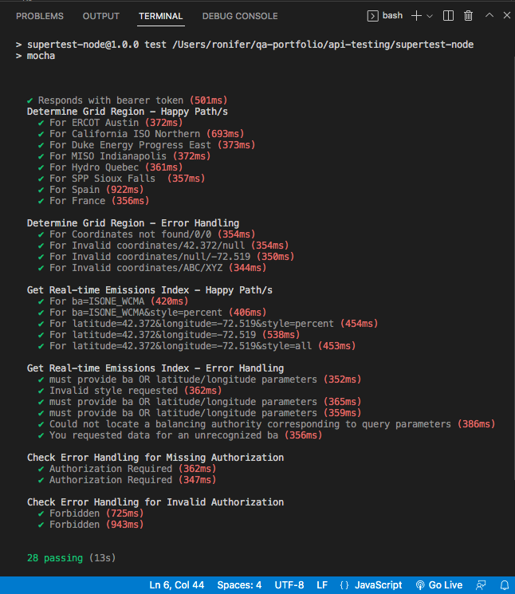

# API Testing with SuperTest

> This Test Suite illustrates how to test API endpoints using the [**SuperTest**](https://github.com/visionmedia/supertest) automation framework.
> 
> Shortcut to spec file:
> * [gridEmissions.spec.js](./test/gridEmissions.spec.js)
> 
> _For the **Karate** version of these tests, click_ [_here_](../karate-dsl). 

## Table of Contents
* [General Info](#general-information)
* [Technologies Used](#technologies-used)
* [Features](#features)
* [Challenges](#challenges)
* [Screenshots](#screenshots)
* [Setup](#setup)
* [Usage](#usage)


## General Information
- Service Under Test: [WattTime API](https://www.watttime.org/api-documentation/#introduction)
  - WattTime provides emissions reduction technology through monitoring.
  - They provide marginal emissions rate data via their API.
  - Confused? Don't be. At the end of the day, it's an API...
  - ...you send it a request and it generates a response.
- Why use this particular API?
  - It's publicly available
  - Self-registration is quick & easy
  - Requires Authentication & Authorization (a common API use-case)
  - Well documented
  - Stable


## Technologies Used
- macOS
- VS Code
- Node.js
- npm
- Mocha
- Chai
- SuperTest


## Features
- Reusable Bearer Token (via `token` variable)
- Secured secret credentials (via `.env.example`)
- Use of Mocha `before()` hooks
- Chai assertion chaining


## Challenges
- Asynchronous nature of JavaScript (addressed by using `done`)
- Organizing tests into Mocha `describe()` groups


## Screenshots



## Setup
1. Clone repository
2. Install VS Code
3. Initiate `npm install` to pick up `package.json` dependencies and install them
    _(This is necessary as node_modules are excluded from version control)_
4. Self register for [WattTime API access](https://www.watttime.org/api-documentation/#register-new-user)


## Usage
1. Enter registered credentials in the `.env.example`  file
    ```
   API_USER='your_api_username_here'
   API_PASS='your_api_password_here'
   ```
2. Remove the `.example` suffix
3. Run `npm test` inside VS Code terminal window
