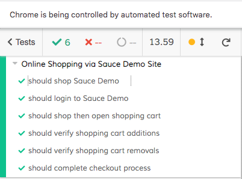

# UI Testing with Cypress

> This Test Suite illustrates how to test a website User Interface using the [**Cypress**](https://github.com/cypress-io/cypress) browser automation framework.
> 
> Shortcut to main spec file:
> * [sauce-demo-shopping.spec.js](./cypress/integration/sauce-demo-shopping.spec.js)
> 
> Shortcut to page object files:
> * [sauce-demo-login-page.js](./cypress/page-objects/sauce-demo-login-page.js)
> * [sauce-demo-products-page.js](./cypress/page-objects/sauce-demo-products-page.js)
> * [sauce-demo-cart-page.js](./cypress/page-objects/sauce-demo-cart-page.js)
> * [sauce-demo-checkout-page.js](./cypress/page-objects/sauce-demo-checkout-page.js)
> 
> Alternatively, a shortcut to the draft **non**-page object model spec file:
> * [sauce_demo.spec.js](./cypress/integration/sauce_demo.spec.js)
> 
> _For the **Selenium Java** version of these tests, click_ [_here_](../selenium-java). <br> _For the **Cucumber-JVM** version of these tests, click_ [_here_](../cucumber-java). 

## Table of Contents
* [General Info](#general-information)
* [Technologies Used](#technologies-used)
* [Features](#features)
* [Challenges](#challenges)
* [Screenshots](#screenshots)
* [Setup](#setup)
* [Usage](#usage)


## General Information
- Service Under Test: [Sauce Labs' Demo Site](https://www.saucedemo.com/)
  - Sauce Labs is an automated testing platform company
  - This is their demo site for automated testing
  - It is a based on a fictional online shop
- Why use this particular demo website?
  - It's publicly available
  - Provided for free by a reputable company
  - Intentionally geared towards automated tests
  - Simple yet typical e-commerce workflows
  - Stable & Static  _(i.e. element ids are not prone to changes and breakage)_
  - Longevity _(i.e. site is expected to remain online indefinitely)_


## Technologies Used
- macOS
- VS Code
- Node.js
- npm
- Mocha


## Features
- Page Object Model implementation
- Masked login credentials (via `cypress.json`)
- Disabled password logging during runs
    ```
     cy.get('#password')
         .type(password, { log:false })
    ``` 
    

## Challenges
- Securing login credentials
    - Though publicly available on the saucedemo site, it is still good practice not to have it viewable in source control.
    - Number of options considered but settled on the use of `cypress.json` for ease and simplicity of implementation.
- Logging of password during runs
    - Solved by setting `{ log:false }` for element


## Screenshots



## Setup
1. Clone repository
2. Install VS Code
3. Initiate `npm install` to pick up `package.json` dependencies and install them <br>  _(This is necessary as node_modules are excluded from version control)_


## Usage
1. Enter login credentials in the `cypress.json`  file
    ```
    "UI_USER": "your_ui_username_here",
    "UI_PASS": "your_ui_password_here"
   ```
2. Remove the `.example` suffix
3. Start Cypress inside VS Code
    `npx cypress open`
4. Then click on `sauce-demo-shopping.spec.js` to run the tests
