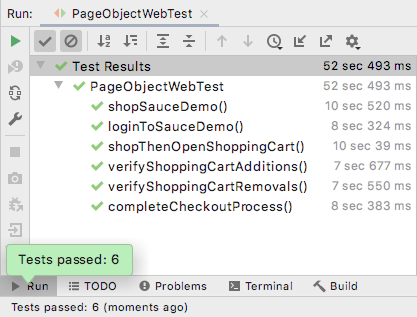

# UI Testing with Selenium Java

> This Test Suite illustrates how to test a website User Interface using the [**Java flavor of the Selenium**](https://www.selenium.dev/documentation/webdriver/) browser automation framework.
> 
> Shortcut to Java test files:
> * [PageObjectWebTest.java](./src/test/java/tests/PageObjectWebTest.java)
> * [AbstractPage.java](./src/test/java/pageobjects/AbstractPage.java)
> * [SauceDemoLoginPage.java](./src/test/java/pageobjects/SauceDemoLoginPage.java)
> * [SauceDemoProductsPage.java](./src/test/java/pageobjects/SauceDemoProductsPage.java)
> * [SauceDemoCartPage.java](./src/test/java/pageobjects/SauceDemoCartPage.java)
> * [SauceDemoCheckoutPage.java](./src/test/java/pageobjects/SauceDemoCheckoutPage.java)
> 
> _For the **Cucumber-JVM** version of these tests, click_ [_here_](../cucumber-java). <br> _For the **Cypress** version of these tests, click_ [_here_](../cypress-node). 

## Table of Contents
* [General Info](#general-information)
* [Technologies Used](#technologies-used)
* [Features](#features)
* [Challenges](#challenges)
* [Screenshots](#screenshots)
* [Setup](#setup)
* [Usage](#usage)


## General Information
- Service Under Test: [Sauce Labs' Demo Site](https://www.saucedemo.com/)
  - Sauce Labs is an automated testing platform company
  - This is their demo site for automated testing
  - It is a based on a fictional online shop
- Why use this particular demo website?
  - It's publicly available
  - Provided for free by a reputable company
  - Intentionally geared towards automated tests
  - Simple yet typical e-commerce workflows
  - Stable & Static  _(i.e. element ids are not prone to changes and breakage)_
  - Longevity _(i.e. site is expected to remain online indefinitely)_


## Technologies Used
- macOS
- IntelliJ IDEA
- Java
- Selenium WebDriver for Java
- ChromeDriver
- JUnit 5
- WebDriverManager
- Maven 


## Features
- Page Object Model implementation
- Use of JUnit Annotations (e.g. `@BeforeEach`, etc.)
- Use of JUnit Assertions (e.g. `.assertEquals`, etc.)
- Hidden login credentials (via `config.properties`)


## Challenges
- Random order of test execution
    - Not necessarily an issue as the tests are self contained (i.e. individual setup & breakdown).
    - Nonetheless, good QA testing is based on good QA test organization and sequence.
    - Solved by using the following annotations:
        - `@TestMethodOrder(MethodOrderer.OrderAnnotation.class)`
        - `@Order(n)`
- Securing login credentials
    - Though publicly available on the saucedemo site, it is still good practice not to have it viewable in source control.
    - Number of options considered but settled on the use of `config.properties` for ease and simplicity of implementation.
- Browser/driver incompatibility during test runs
    - Resolved by importing `WebDriverManager`


## Screenshots



## Setup
1. Clone repository
2. Install IntelliJ IDEA
3. Allow Maven to build dependencies off the `pom.xml`


## Usage
1. Enter login credentials in the `config.properties`  file
    ```
   UI_USER=your_ui_username_here
   UI_PASS=your_ui_password_here
   ```
2. Remove the `.example` suffix
3. Run `PageObjectWebTest.java` inside IntelliJ
